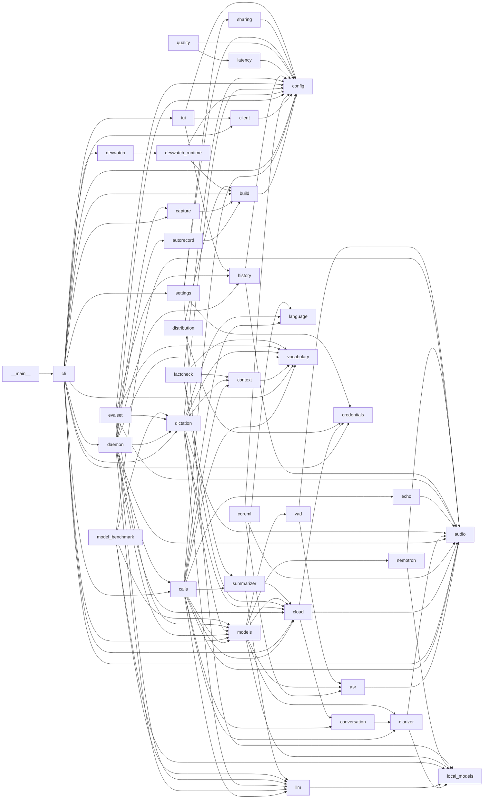

# Архитектура

Карта Python-кода. Её обновляет агент: в PR, который меняет модули, публичные функции или типы, и на структурном ревью. Строится по коду (команда Graph в AGENTS.md), а не по плану. Swift-часть (`wav2sum/native/`) и протокол сокета описаны в SPEC.md.

Последняя проверка структуры: упрощение dev-watch, один сборщик для install/bootstrap/watch; дублирующий platform-модуль удалён. Фактический `uv run --offline --no-sync pydeps wav2sum --show-deps --no-output --only wav2sum`: 39 модулей без корневого пакета, 112 внутренних связей; граф ацикличен. Хранение app preferences находится в config, JSON setup bridge — в settings; обратной зависимости config→settings нет.

Запись сохраняется автоматически. По умолчанию stop/startup не ставят её в очередь; отдельный auto-process opt-in ставит успешно завершённую запись в обычную очередь (local transcript-only, cloud с отдельным согласием на автоматические uploads). Вручную доступны TUI process и cloud summary-last. Recording lock и busy guards запрещают configure при recorder/streams/loading/queued/running jobs; смена mode/model сохраняет preferences и завершает idle daemon, native ждёт exit перед новым стартом. Активная/неоднозначная/дублированная/partial запись не перезаписывается. Прямой CLI process вне daemon этими guards не охвачен.

`summarize_last_meeting` — отдельная cloud-only операция: последний собственный completed call по started_at, готовый summary открывается, существующий transcript не распознаётся повторно; queued summary-only job использует уже известный `out_dir`. Формат Job не меняется. Startup/hourly maintenance вызывает atomic seven-day prune только dictations.jsonl и рассылает count-only history_pruned; TUI перечитывает историю. Vocabulary/edits/calls не очищаются.

## Модули

```mermaid
graph LR
  __main__ --> cli
  asr --> audio
  autorecord --> build
  build --> config
  calls --> audio
  calls --> cloud
  calls --> config
  calls --> context
  calls --> conversation
  calls --> diarizer
  calls --> echo
  calls --> language
  calls --> llm
  calls --> models
  calls --> summarizer
  calls --> vocabulary
  capture --> build
  cli --> audio
  cli --> build
  cli --> calls
  cli --> capture
  cli --> client
  cli --> cloud
  cli --> config
  cli --> credentials
  cli --> daemon
  cli --> devwatch
  cli --> dictation
  cli --> models
  cli --> settings
  cli --> tui
  cli --> vocabulary
  client --> config
  cloud --> audio
  cloud --> conversation
  cloud --> credentials
  context --> vocabulary
  conversation --> diarizer
  coreml --> asr
  coreml --> audio
  coreml --> config
  daemon --> audio
  daemon --> autorecord
  daemon --> calls
  daemon --> capture
  daemon --> cloud
  daemon --> config
  daemon --> dictation
  daemon --> history
  daemon --> llm
  daemon --> models
  daemon --> vocabulary
  devwatch --> devwatch_runtime
  devwatch_runtime --> build
  devwatch_runtime --> config
  diarizer --> audio
  diarizer --> local_models
  dictation --> audio
  dictation --> cloud
  dictation --> config
  dictation --> context
  dictation --> language
  dictation --> llm
  dictation --> models
  dictation --> vocabulary
  distribution --> build
  distribution --> credentials
  echo --> audio
  evalset --> audio
  evalset --> config
  evalset --> dictation
  evalset --> history
  evalset --> llm
  evalset --> models
  evalset --> vocabulary
  factcheck --> cloud
  factcheck --> config
  factcheck --> context
  factcheck --> summarizer
  factcheck --> vocabulary
  history --> audio
  history --> config
  latency --> config
  llm --> local_models
  model_benchmark --> audio
  model_benchmark --> dictation
  model_benchmark --> llm
  model_benchmark --> local_models
  model_benchmark --> models
  models --> asr
  models --> cloud
  models --> diarizer
  models --> local_models
  models --> nemotron
  models --> vad
  nemotron --> audio
  nemotron --> local_models
  quality --> config
  quality --> latency
  settings --> config
  settings --> credentials
  settings --> local_models
  settings --> sharing
  sharing --> config
  summarizer --> cloud
  summarizer --> language
  summarizer --> llm
  tui --> client
  tui --> config
  tui --> history
  vad --> asr
  vad --> audio
```

| Модуль | Отвечает за | Зависит от |
|---|---|---|
| `cli` | явный CLI cloud, команды app/daemon/TUI/process/dictate, opt-in dev-watch и JSON setup bridge | audio, build, calls, capture, client, cloud, config, credentials, daemon, devwatch, dictation, models, settings, tui, vocabulary |
| `devwatch` | debounce, immutable snapshot handoff, повторы/восстановление и безопасное завершение dev-сессии | devwatch_runtime |
| `devwatch_runtime` | lock, verified exact-child pipes, перепроверка bundle/путей и lifetime только собственного scratch; использует общий builder | build, config |
| `daemon` | mode/busy/configure guards, manual/opt-in automatic call jobs, ordered dictation/cancel, startup/hourly retention | audio, autorecord, calls, capture, cloud, config, dictation, history, llm, models, vocabulary |
| `client` | клиент сокета демона для CLI и TUI | config |
| `tui` | Textual: звонки, диктовки, поиск/удаление; refresh истории по history_pruned | client, config, history |
| `calls` | local echo/VAD/pyannote/Qwen или Nemotron без summary, backend-specific cache; cloud grounded summary и summary-only | audio, cloud, config, context, conversation, diarizer, echo, language, llm, models, summarizer, vocabulary |
| `capture` | запись звонка Swift-хелпером в WAV | build |
| `autorecord` | какое приложение держит микрофон, когда начать и остановить запись | build |
| `build` | единый immutable snapshot → app/icon/digest/sign, проверка dev signature/layout, атомарная публикация install/bootstrap/watch; bundled capture_helper берётся из проверенного executable env path | config |
| `echo` | вычитание эха системного канала из микрофона | audio |
| `conversation` | нарезка по репликам, склейка, формат транскрипта | diarizer |
| `summarizer` | проверенные видимые ссылки на реплики, source-preserving фрагментация/сведение в пределах контекста; отдельные главы | cloud, language, llm |
| `dictation` | фиксированный контекст, прямая LLM-чистка без семантических эвристик; cloud upload без preview или incremental local с ограниченным хвостом | audio, cloud, config, context, language, llm, models, vocabulary |
| `context` | фиксированные ограниченные подсказки и точная транслитерация смешанных алфавитов в заданный термин; без I/O | vocabulary |
| `models` | lazy режим и call_model, memory warning override, scoped call_session освобождает Qwen/Nemotron | asr, cloud, diarizer, local_models, nemotron, vad |
| `asr` | pinned offline Qwen для диктовки/лёгких звонков; GigaAM для Core ML-утилиты | audio |
| `cloud` | Deepgram batch HTTP для звонков/файлов и один chunked upload диктовки; OpenAI HTTPS с ленивым per-client keepalive; proxy/TLS, безопасные ошибки и запрет редиректов/replay | audio, conversation, credentials |
| `credentials` | explicit env/Keychain/opt-in beta resource lookup, native secret storage, hidden interactive setup; no passive Keychain read or denial bypass | — |
| `nemotron` | speech.cpp protocol 3, явные overrides/new model root/legacy paths, on-demand worker и reap | audio, local_models |
| `vad` | batch Silero для звонка и изолированное incremental-состояние диктовки на чанках 512 сэмплов | asr, audio |
| `diarizer` | prepared pinned local pyannote или explicit legacy HF auth; telemetry off | audio, local_models |
| `language` | RU/EN по финальному тексту для чистки/summary; старый SpeechBrain удалён | — |
| `llm` | mlx-lm worker, pinned prepared default Gemma, unload/prefix cache/prompt lookup | local_models |
| `vocabulary` | словарь замен, который учится на правках | — |
| `history` | история/ручное удаление; atomic seven-day prune под общим lock, сохранение unknown-age и отказ от malformed/unsafe files | audio, config |
| `config` | TOML, app preference schema/consent, atomic private JSON save/load, runtime-only CLI cloud, shared file lock | — |
| `audio` | загрузка звука, PCM, хеш файла | — |
| `coreml` | конвертация GigaAM в Core ML (CHU-98), только macOS | asr, audio, config |
| `evalset` | WER диктовки на наборе фраз | audio, config, dictation, history, llm, models, vocabulary |
| `factcheck` | cloud summary с таймкодами; игнорирование ссылок при проверке чисел/имён; требует `--cloud` | cloud, config, context, summarizer, vocabulary |
| `latency` | read-only p50/p90 частей и local/cloud streaming p50/p95/отношение отправленного к полученному | config |
| `quality` | качество диктовки по истории | config, latency |
| `settings` | JSON stdin/stdout app bridge, passive status, explicit Keychain/download/configure/export actions, sanitized errors | config, credentials, local_models, sharing |
| `sharing` | read-only locked snapshots, content ids, confirmed selected text-only consent export, atomic no-clobber | config |
| `local_models` | privacy-safe hardware, provisional RAM profiles, memory guard, pinned explicit model/runtime preparation | — |
| `model_benchmark` | synthetic/explicit local ASR+cleanup repeats, quality refs, process-tree RSS/system swap, no text by default | audio, dictation, llm, local_models, models |
| `distribution` | fresh app/DMG, runtime/FFmpeg/codec relocation; ordinary build without keys, explicit private-beta hidden prompts and signed credentials resource | build, credentials |

## Публичные функции

Только те, что зовут из других модулей.

| Функция | Вход | Выход | Побочные эффекты | Кто вызывает |
|---|---|---|---|---|
| `cli.main` | argv | — | всё, что делает команда | `__main__` |
| `credentials.credential` | имя Deepgram/OpenAI API_KEY | секрет | env → собственный Keychain → opt-in beta resource → ошибка; только cloud; denial fail closed, без фоновых prompts | cloud |
| `credentials.configure` | экспорт или скрытый интерактивный ввод обоих ключей | — | Security.framework через ctypes, add/update generic-password без удаления ACL; нет argv/конфига/логов с секретом | cli (`cloud-keys`) |
| `credentials.Keychain` | service/account; get/set | секрет или None для отсутствующего item | native CF/Security API; ошибки доступа не превращаются в отсутствие ключа | credentials |
| `credentials.has_bundled_credentials` | — | bool presence | stat resource без чтения секрета/Keychain; не проверка действительности ключей | settings |
| `daemon.serve` | `Config`, `verbose` | — | конфиг по умолчанию, лог/сокет; shutdown ждёт in-flight model work и закрывает dictation/summary clients | cli |
| `client.DaemonClient` | запросы, явный ожидаемый cloud-флаг | ответы, события | соединение и передача режима с каждым запросом; mismatch не вызывает fallback | cli, tui |
| `calls.process` | звук, `Models` с режимом, папка, cloud LLM, раскладка/спикеры/язык | `Result` | прежние transcript/meta/cache; новый summary только cloud; params кэша различают backend | cli, daemon |
| `calls.summarize_existing` | processed folder, cloud LLM, vocabulary/dictionary | `Path` результата | читает transcript/meta, использует прежний grounded summary/chapters; атомарно добавляет только отсутствующий summary.md, не переписывает transcript/audio/meta | daemon |
| `capture.CallRecorder` | путь WAV, микрофон, приложение звонка | `start`/`wait`/`stop` | процесс хелпера, WAV и сайдкар `.json` | cli, daemon |
| `capture.list_mics` | — | `str` | собирает и запускает хелпер | cli |
| `capture.new_recording_path` | папка записей | `Path` | нет | cli, daemon |
| `autorecord.CallDetector` | события микрофона | решение start/stop | нет | daemon |
| `build.capture_helper` | optional executable env path | `Path` | bundled helper validation без компиляции; иначе development build/sign/cache | autorecord, capture |
| `build.install_app`, `bootstrap_watch_app` | — | `Path` | собирает из source snapshot и подписывает staging; bootstrap требует совпадающую постоянную подпись, dev bundle и неизменный Info.plist; без `pkill`, прежний bundle сохраняется | cli, явный bootstrap |
| `build.source_snapshot`, `source_digest` | app source dir / snapshot, serve argv, signer | bytes по относительным именам / 12hex framed digest | читает только Swift app/icon; digest без I/O | install/bootstrap, devwatch_runtime |
| `build.build_app`, `verify_dev_app` | immutable snapshot, новый stage, plist/signature / dev bundle, serve argv | stage / leaf+requirement | общий Swift/icon/sign pipeline с собственным временным scratch / проверка layout/env/codesign; без публикации и запуска | install/bootstrap, devwatch_runtime |
| `build._atomic_publish`, `_check_no_app_process` | stage/target/swap / — | — / отказ | exclusive publish/atomic exchange без удаления / консервативный pgrep; общие preflight/publication для installer и watcher | install/bootstrap, devwatch_runtime |
| `devwatch.run` | `cloud` | — | opt-in цикл handoff; первый Ctrl-C завершает текущий control reply, ждёт работу и закрывает только dev-app; второй прерывает ожидание, daemon не перезапускает | cli |
| `devwatch_runtime.Runtime` | child pipes, snapshots и stage | операции watcher | verified signing/identity/path, process preflight, owned child, обмен/rollback и очистка только своего scratch после ACK | devwatch |
| `asr.QwenTranscriber` | mono 16 кГц, спаны, язык, keyword-only `terms` | текст без контекста/служебных тегов; ошибка обрезанного ответа | закреплённый checkpoint, contextual processor prompt, lock | models, dictation через Models |
| `cloud.DeepgramTranscriber` | mono/stereo 16 кГц, язык/раскладка, `terms`; optional keyword-only `timeout` у `transcribe`; `start_dictation` | batch HTTP-текст/реплики или lazy `DeepgramUpload` без запроса/ключей до аудио | cloud-only HTTPS; `DEEPGRAM_API_KEY`; повторные `keyterm`; auto/multi — `language_hint=ru,en`, explicit ru/en без hint; batch timeout по умолчанию 300 с | models, calls/dictation через Models |
| `cloud.DeepgramUpload` | `add` PCM, `finish`, `close`, `sent_samples` | только полный финальный текст после EOF, кэш успешного finish | один worker/HTTP chunked request с первого непустого add; ограниченный backlog (один готовый вход может быть крупным), overflow — ошибка; finish deadline 20 с, close будит ожидание/делает best-effort socket shutdown; DNS/connect могут завершиться позже; default proxy/TLS/no redirect/replay | DeepgramTranscriber, DictationStream |
| `context.recognition_terms` | источники строк в порядке приоритета | tuple до 50 терминов / 500 UTF-8 байт | нет | calls, dictation, factcheck |
| `context.canonicalize_terms` | текст ASR и заданные термины | каноническое написание только mixed Cyrillic/Latin слова с точной транслитерацией | нет; таблица TRANSLIT читается из модуля, файл словаря не загружается | calls, dictation |
| `cloud.OpenAILLM` | промпт, примеры, ограничения; model (default Terra), optional `service_tier`; `preconnect()` | завершённый текст; консервативный UTF-8 `count_tokens`; optional Thread handle preconnect | direct HTTP/1.1 keepalive/verified TLS; best-effort TCP/TLS без HTTP/ключей, один worker вне lock; foreground не ждёт warming, generation/close отбрасывает поздний socket; proxy — прежний urllib без preconnect; без POST replay; Terra/Luna `reasoning_effort=none` | cli/daemon/factcheck владеют lifetime; DictationStream использует Luna/Fast и preconnect |
| `nemotron.NemotronTranscriber` | PCM, спаны, язык, keyword-only `terms`, binary/GGUF | полный текст | worker protocol 3, contextual `prompt`, close/reap | models |
| `dictation.Dictator` | звук, приложение, режим, текст у курсора | `Dictation` | local Gemma или cloud Luna/Fast; прямой LLM cleanup без regex/semantic guards; snippets/словарь/курсор сохраняются | cli, daemon, evalset |
| `dictation.DictationStream` | PCM-чанки и `DictationContext`; step/finish/close | local preview, финальный текст/язык, счётчики samples/revision и timings | local incremental VAD/ограниченный хвост; cloud лениво создаёт upload и сразу отдаёт аудио, не хранит весь float PCM; при cleanup входящее аудио также готовит/обновляет OpenAI connection (владелец — общий LLM-клиент); finish single-flight/canonicalize/cache; close отменяет upload вне session lock и отбрасывает поздний результат | daemon, Dictator |
| `vad.VoiceActivityDetector`, `vad.VoiceActivityStream` | batch PCM или последовательные чанки | batch spans; completed/preview spans и finish в абсолютных секундах | отдельная reset-копия Silero на сессию, без повторной обработки старого PCM | models, dictation через Models |
| `dictation.user_examples` | правки из `edits.jsonl` | примеры на стиль и язык | нет | daemon, evalset |
| `summarizer.summarize` | таймкодированный speaker-labelled транскрипт, LLM, термины, язык | summary с точными видимыми `[U… время–время]` | bounded map/reduce; некорректный/чужой источник — ошибка, не uncited fallback | calls, factcheck |
| `summarizer.chapters` | транскрипт с таймкодами, `LLM`, язык | `str` | вызывает LLM | calls |
| `llm.LLM` | локальная модель, контекст, время жизни | `chat`, `count_tokens`, `unload` | MLX, поток `llm`, кэш/таймеры локальной диктовки | dictation, evalset; типы calls/summarizer |
| `llm.memory_mb` | — | `int` | нет | daemon |
| `models.Models` | device, cloud, call_model, allow_unsafe_nemotron | lazy dictation/call ASR, VAD/diarizer, preload/session/unload | Qwen либо guarded Nemotron; call_session освобождает только call ASR, dictation остаётся; no cloud fallback | calls, cli, daemon, dictation, evalset, benchmark |
| `vocabulary.Vocabulary` | путь к `vocabulary.json` | `words`, `apply`, `learn` | `learn` пишет `vocabulary.json` | calls, cli, daemon, dictation, evalset, factcheck |
| `history.load_dictations` | путь, лимит | `list[dict]` | нет | daemon, evalset, tui |
| `history.append_dictation` | запись | — | дописывает `dictations.jsonl` под lock | daemon |
| `history.delete_dictation` | запись | `bool` | переписывает `dictations.jsonl` под lock | tui |
| `history.prune_dictations` | path, optional aware now | число удалённых строк | fixed 7×24h cutoff UTC; shared lock/atomic replace, retained bytes/order/mode; unknown/naive/future сохраняются, malformed/unsafe/I/O failure не теряет оригинал; vocabulary/edits/calls не читает и не меняет | daemon startup/hourly maintenance |
| `history.delete_call` | папка звонка, папка записей | — | в Корзину папку, кэш и свою запись | tui |
| `config.load_config` | TOML path, optional preferences_path | `Config` | читает TOML/app preferences, не меняет CLI cloud и пользовательские пути | cli, coreml, evalset, factcheck |
| `config.exclusive` | путь, `wait` | `bool` | `flock` без truncation; `O_NOFOLLOW`, regular file и один hardlink | build, cli, history, config preferences, sharing |
| `audio.load_audio` | путь, каналы | `np.ndarray` | ffmpeg | calls, cli, coreml, evalset |
| `audio.file_hash` | путь | `str` | читает файл | calls, history |
| `audio.pcm16_to_float` | `bytes` | `np.ndarray` | нет | daemon |
| `echo.suppress_echo` | микрофон, системный канал | `np.ndarray` | нет | calls |
| `conversation.*` | спаны, реплики, `Turn` | реплики, текст | нет | calls |
| `language.text_language` | финальный текст | RU/EN для промпта | нет | calls, dictation |
| `config.validate_settings`, `load_preferences`, `save_preferences`, `apply_preferences` | explicit mode/models/consent choices и optional path | validated dict / Config mutation | booleans/enums/отдельные cloud consents; private atomic JSON under shared lock, отказ от unsafe file; ключи не сохраняются | settings, daemon, load_config |
| `settings.handle`, `settings.main` | local JSON request / stdin pipe | single JSON reply | status без keys/downloads; explicit configure RPC, Keychain save, model prepare, reviewed export; sanitized failures | CLI setup, native DaemonProcess |
| `sharing.list_examples`, `export_examples` | history/edits paths; selected ids/targets/confirmed, consent, new destination | list / count | locks, revalidation current sources; только text allowlist, atomic no overwrite; no source mutation/network | settings, native SharingWindow |
| `local_models.hardware_info`, `recommendation`, `check_memory`, `model_status` | optional hardware dict, model selection/override | privacy-safe dict / validation | no serial/UUID, no passive downloads/keys; provisional 16/24/32/48 classes, memory guard not safety proof | models, settings, benchmark |
| `local_models.prepare_models`, `snapshot_path`, `speech_paths`, `model_root` | selected pinned models, optional explicit HF token | status / local paths | explicit public downloads/checksums; gated pyannote access not accepted automatically, no audio/text upload or token persistence | settings, asr/llm/diarizer/nemotron |
| `model_benchmark.benchmark`, `error_rate`, `summarize_timings`, `MemorySampler`, `main` | explicit or synthetic audio, separate spoken/clean references, repeats>=3 | timing/quality/RSS/swap JSON | actual local inference, TTS generation, sampled metrics with limits, no text unless requested | module CLI / friend measurements |
| `distribution.create_distribution`, `main` | new output, optional no_dmg/beta_keys; CLI private-beta hidden prompts | app path / CLI report | compile/copy/fix/audit/sign/relocation/decode/DMG; optional friend credentials only in copied package, owner-only private output; no live install or implicit key lookup | module CLI |

## Типы и модели данных

| Тип | Где определён | Поля | Наследует / содержит |
|---|---|---|---|
| `Config` | `config.py` | прежние поля, `auto_process`, `call_model`, `allow_unsafe_nemotron`, runtime-only `cloud`/`auto_cloud_consent` | app preferences overlay processing only, не CLI cloud; separate upload consent не TOML-флаг |
| `DictationConfig` | `config.py` | `hotkey`, `model`, `cleanup`, `learn`, `dictionary`, `snippets`, `apps` | — |
| `Speakers` | `calls.py` | `count`, `min`, `max` | — |
| `Names` | `calls.py` | `me`, `them`, `diarized` | — |
| `Result` | `calls.py` | `out_dir`, `layout`, `language`, `duration_sec`, `utterances`, `summary`, `timings` | содержит `Utterance` |
| `Utterance` | `conversation.py` | `start`, `end`, `text`, `speaker` | — |
| `Piece` | `conversation.py` | `start`, `end`, `speaker` | — |
| `Turn` | `diarizer.py` | `speaker`, `start`, `end` | — |
| `Level` | `capture.py` | `seconds`, `mic_db`, `sys_db` | — |
| `Job` | `daemon.py` | `id`, `audio`, `state`, `stage`, `out_dir`, `error` | — |
| `DictationSession` | `daemon.py` | `stream`, `session`, `step`, `error`, `preview`, `finishing`, `finalized_at` | состояние соединения; финал захватывает объект до фонового запуска |
| `DictationContext` | `dictation.py` | `style`, `language`, `dictionary`, `terms`, `fixes`, `snippets` | frozen dataclass с tuple-полями, snapshot в начале сессии |
| `Dictation` | `dictation.py` | `raw`, `text`, `style`, `language`, `command`, `timings`, `translate` | — |
| `LLM` | `llm.py` | `model`, `num_ctx`, `temperature`, `think`, `keep_alive`, `timeout`, `cache_prefix` | — |
| `Prompts` | `dictation.py`, `summarizer.py` | тексты промптов на язык | — |

## Известные проблемы

- `daemon.py`: `json.loads` строки запроса стоит вне `try`, битая строка молча закрывает соединение без лога (CHU-153, не исправлено).
- Development capture/autorecord по-прежнему могут собирать helper через build.capture_helper; standalone app передаёт уже собранный helper, поэтому Xcode на машине получателя не нужен.
