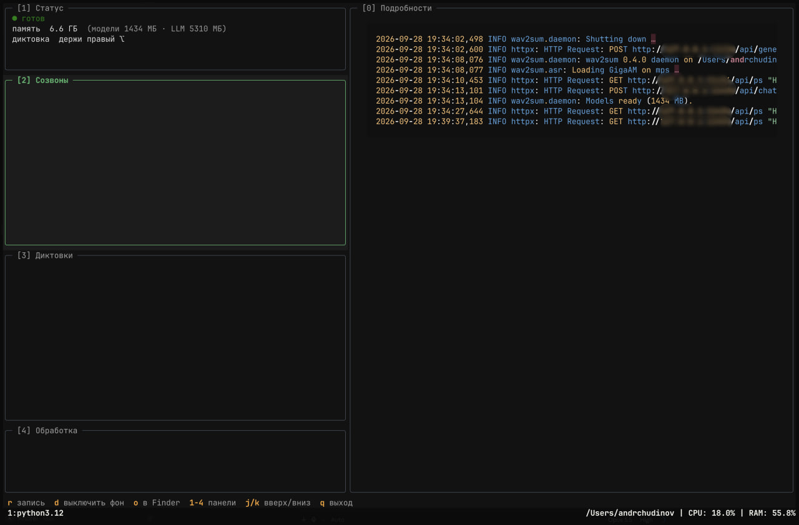

# wav2sum

A local Krisp + Wispr Flow for macOS: call recording with a summary, and voice dictation into any app. Russian only.



## Setup

```bash
uv tool install -e .
ollama pull gemma4:e4b-it-qat
wav2sum app
```

`wav2sum app` puts an icon in the menu bar and starts the background process. On first launch, allow Microphone,
Accessibility, Input Monitoring, and System Audio Recording.

## Usage

- **Dictation.** Hold right ⌥, speak, release, and the text is typed into the active app. Double-tap for hands-free mode;
  Esc cancels.
- **Edit by voice.** Select some text, hold ⇧ + right ⌥, and say what to do ("make it shorter", "translate to English").
- **Calls.** Recording starts by itself when Zoom, Teams, or Webex takes the microphone and stops once the call ends.
  To record anything else, choose "Record Call" in the menu bar, then "Stop Recording". The transcript and summary
  show up in `~/wav2sum/output/`.
- **Learning from edits.** If you fix a term or a name right after dictating ("гитхаб" → "GitHub"), wav2sum remembers
  it and writes it that way next time. Learned words live in `~/Library/Application Support/wav2sum/vocabulary.json`.
- **History and summaries.** Run `wav2sum tui`. Press `x` on a call or a dictation to delete it; calls go to the Trash.
- **An existing file.** Run `wav2sum meeting.mp3`.

## Config

`~/.config/wav2sum/config.toml`:

```toml
me = "Андрей"
them = "Илья"
model = "gemma4:e4b-it-qat"
auto_record = true
call_apps = ["us.zoom", "com.microsoft.teams2", "Cisco-Systems.Spark"]  # bundle id prefixes

[dictation]
model = "gemma4:e4b-it-qat"
learn = true
dictionary = ["Kubernetes", "GigaAM"]
snippets = { "мой имейл" = "me@example.com" }
```

## Keeping permissions across updates

macOS ties privacy permissions to the app's signature. By default the app is signed ad hoc, so every rebuild after an
update asks for them again. To keep them, create a signing certificate once: Keychain Access → Certificate Assistant →
Create a Certificate…, name `wav2sum`, identity type Self-Signed Root, certificate type Code Signing. Then run
`wav2sum app` and grant the permissions one last time.

## Development

```bash
uv run pytest && uv run ruff check && uv run ruff format --check
```
